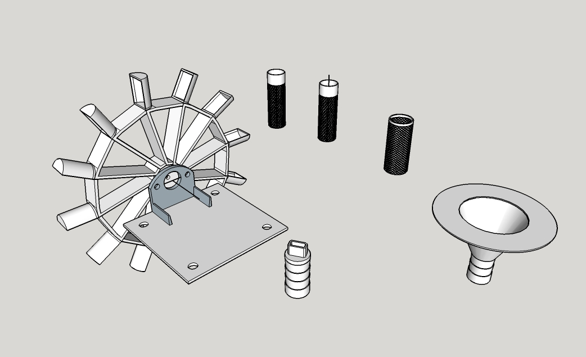

# Wasserkraftwerk - ein Projekt im Rahmen des apokalyptischen Zombiecamps im www.projekt-draussen.com mit dem www.erfindergarden.de #

Zusammen mit den Kindern haben wir im Schindergraben, direkt unterhalb vom projekt-draussen, einen Schlauch im Bachlauf verlegt. Anschließend mit google SketchUp ein Wasserrad, eine Auslassdüse und einen Ansaugfilterstutzen konstruiert. Die Bauteile wurden dann auf einem Craftbot ausgedruckt und in der Werktstatt von porjekt-draussen montiert. Die Baupläne und Fotos gibt es hier auf git-hub. Einen Film vom laufenden Rad [hier](https://www.facebook.com/erfindergarden/videos/680295902173267/ "Video auf facebook bei erfindergarden")

Danke an:

... Google SketchUp für die kostenlose Pro-Version für unsere Arbeit mit den Kindern. 

... Rolf und Philipp von [projekt-draussen](http://www.projekt-draussen.com/ueberblick/#team)

... Andreas Kopp vom [erfindergarden](http://www.erfindergarden.de)
